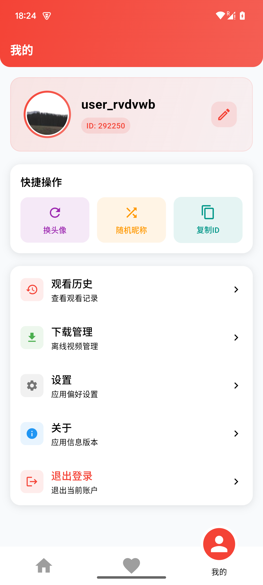
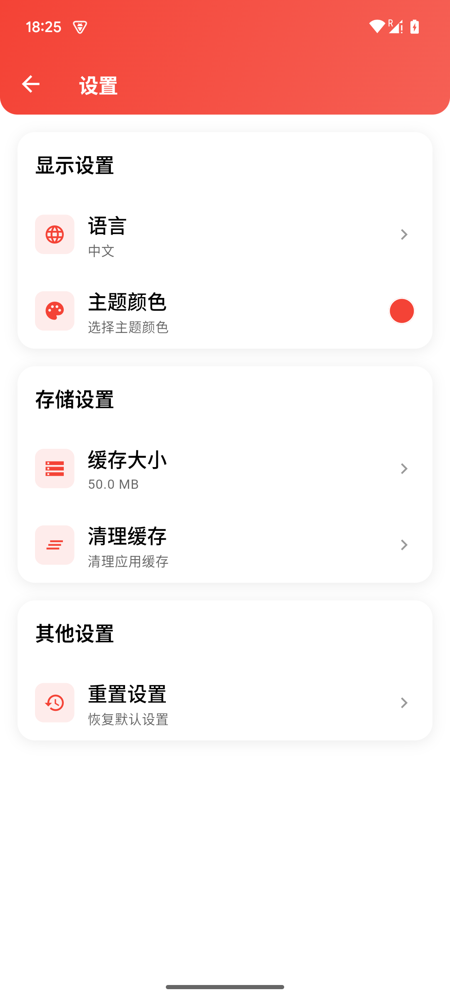

# 🎬 哈吉米短剧

✨ Flutter 短剧应用，采用 MVVM + Provider 架构，支持抖音式视频播放体验 📱

## 📸 应用截图

<div align="center">
  
  
  
</div>
<br>
<div align="center">
  
  
  
</div>

## 🎬 演示动画

<div align="center">
  
</div>

## ✨ 核心特性

- 🏗️ **架构设计**：MVVM + Provider 状态管理
- 📱 **视频播放**：抖音式上下滑切集，沉浸式全屏，预加载优化
- 💾 **数据持久化**：SQLite 本地存储（设置、收藏、历史）
- 🧭 **路由导航**：Fluro 路由 + NavigatorUtils 统一跳转
- 🔄 **列表交互**：下拉刷新 + 上拉加载更多（EasyRefresh）
- 🌍 **国际化**：中英文支持
- 🖼️ **图片缓存**：SvCacheImage 组件

## 🛠️ 技术栈

- 🚀 Flutter 3.22.x
- 🎥 video_player（原生播放）
- 🗄️ sqflite（本地数据库）
- 🔄 provider（状态管理）
- 🛣️ fluro（路由管理）

## 🚀 快速开始

```bash
# 📦 安装依赖
flutter pub get

# 🏃‍♂️ 运行应用
flutter run

# 📱 构建 APK
flutter build apk --debug
```

## 📁 项目结构

```
lib/
├── 📋 constants/     # 常量配置
├── 🗄️ database/      # SQLite 封装
├── 📊 models/        # 数据模型
├── 🌐 services/      # 网络服务
├── 🧠 viewmodels/    # 视图模型
├── 🎨 views/         # 页面视图
├── 🧩 widgets/       # 通用组件
├── 🛣️ router/        # 路由配置
└── 🔧 utils/         # 工具类
```

## 🗄️ 数据库说明

- 📊 版本：1（仅初始化，无迁移）
- 📋 表：settings、search_history、user_favorites、play_history
- 🔄 升级策略：schema 变更时提示用户重装应用

## 🙏 特别感谢

感谢 [艾福森昵 (afosne)](https://linux.do/t/topic/853971) 的支持与贡献！

---

👨‍💻 **作者**: Donkor
📅 **更新**: 2025-09-11
⭐ **如果觉得不错，请给个 Star 吧！** 🌟
